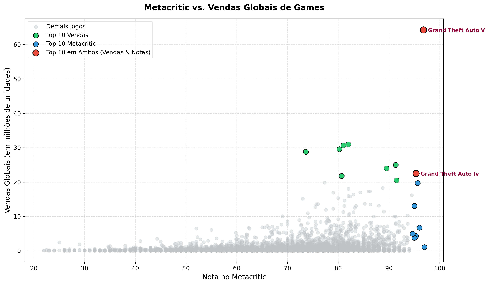

## Objetivos
# O objetivo desse projeto, primeiramente, é desenvolver minhas habilidades em análise de dados em Python e fazer uma discussão estatística do resultado. É um projeto de estudo, então obviamente haverá alguns erros ou pontos que posso ter deixado de notar; além disso, existem as limitações das bases de dados que usei no projeto que, por estarem um pouco desatualizadas, não contabilizam todas as vendas dos jogos. A meta é melhorar o coding e a discussão teórica conforme concluo mais projetos ;)

# A ideia central do projeto é ver se existe relação entre o número de vendas globais de um jogo e sua nota no Metacritic. Será que as reviews de críticos têm impactado no sucesso comercial dos jogos? Jogos muito bem avaliados SEMPRE têm alcançado sucesso comercial?

## Tecnologias
# Foram utilizadas as bibliotecas Pandas para leitura, limpeza e filtragem de dados e Matplotlib para a construção dos gráficos, além do Jupyter Notebook como ambiente de desenvolvimento.
## Tratamento de Dados
# O primeiro passo foi o tratamento dos dados baixados do Kaggle. Nosso dataset inicial de vendas e de notas no Metacritic estava bem bagunçado, então padronizei os nomes dos jogos, deixando todos em minúsculo e removendo os espaços extras — isso permite o cruzamento entre as duas tabelas (vendas x Metacritic). Além disso, alguns jogos na lista não apresentavam o número de vendas, por restrições de divulgação da empresa ou falta de dados, então os removi da lista. Após isso, havia algumas duplicatas nas bases de dados; o motivo é que há jogos que são lançados para mais de uma plataforma (PS4, Xbox One, PC), então eu somei os dados de vendas de todas as plataformas. Ao final, foi criada uma nova base de dados limpa que pode ser encontrada na pasta data desse repositório. Além dela, as outras bases de dados que usei também estão disponíveis lá.
## Resultados
### 🏆 Top 10 - Aclamação Crítica (Metacritic)

| Jogo | Vendas Globais (Mi) | Nota Metacritic |
| :--- | :---: | :---: |
| nfl 2k1 | 1.09 | 97.0 |
| grand theft auto v | 64.29 | 96.8 |
| uncharted 2: among thieves | 6.74 | 96.0 |
| red dead redemption 2 | 19.71 | 95.7 |
| bioshock | 4.27 | 95.3 |
| grand theft auto iv | 22.53 | 95.3 |
| grand theft auto iii | 13.11 | 95.0 |
| portal 2 | 3.79 | 95.0 |
| red dead redemption | 13.07 | 95.0 |
| mass effect 2 | 4.95 | 94.7 |

### 💰 Top 10 - Maiores Vendas Globais

| Jogo | Vendas Globais (Mi) | Nota Metacritic |
| :--- | :---: | :---: |
| grand theft auto v | 64.29 | 96.8 |
| call of duty: black ops | 30.99 | 82.0 |
| call of duty: modern warfare 3 | 30.71 | 81.0 |
| call of duty: black ops ii | 29.59 | 80.3 |
| call of duty: ghosts | 28.80 | 73.6 |
| call of duty: modern warfare 2 | 25.02 | 91.3 |
| minecraft | 24.01 | 89.5 |
| grand theft auto iv | 22.53 | 95.3 |
| call of duty: advanced warfare | 21.78 | 80.7 |
| the elder scrolls v: skyrim | 20.51 | 91.5 |

# Minha ideia para plotar os gráficos foi destacar o top 10 de vendas e o top 10 de notas, e ver como o top 10 de cada categoria se comporta em relação à massa geral de dados. Destaquei também os jogos que estão em ambas as listas.

  

## Conclusão 

# Podemos ver inicialmente que os títulos GTA IV e GTA V aparecem em ambos os top 10, mostrando que a Rockstar é uma empresa que tem tanto o apoio do público quanto o sucesso com os críticos. GTA V aparece totalmente destoando dos outros jogos, estando no canto superior direito: alcançou o maior número de vendas e uma nota alta.

# De acordo com o gráfico, a tendência dos jogos no mercado é ficar abaixo dos 10 milhões em vendas. A nota está influenciando nas vendas? Sim, vemos que a parte superior esquerda está vazia, ou seja, nota baixa = venda baixa. Porém, nota alta não implica sucesso absoluto em vendas; os jogos com notas altas apresentam dispersão no eixo das vendas, o que cria uma distribuição assimétrica à direita.

# A nota, então, é uma condição necessária, mas não suficiente para o sucesso comercial. Fatores como marketing por parte da empresa, jogo nichado ou com mecânicas complexas podem fazer com que o jogo tenha aclamação da crítica, mas uma quantidade moderada de vendas.

# A discussão estatística completa e o código do projeto podem ser encontrados na pasta scripts. Na pasta data tem todos os datasets usados no projeto; além disso, também fiz uma análise levando em consideração apenas o gênero de RPG (meu preferido). Será que o gráfico ficou parecido com o geral? Entre lá e confira ;)
